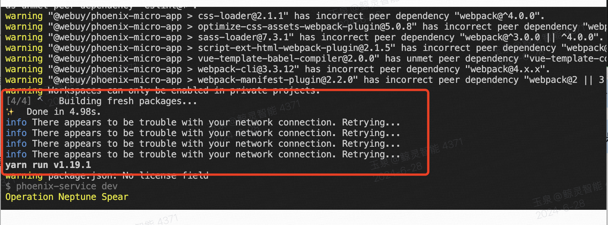
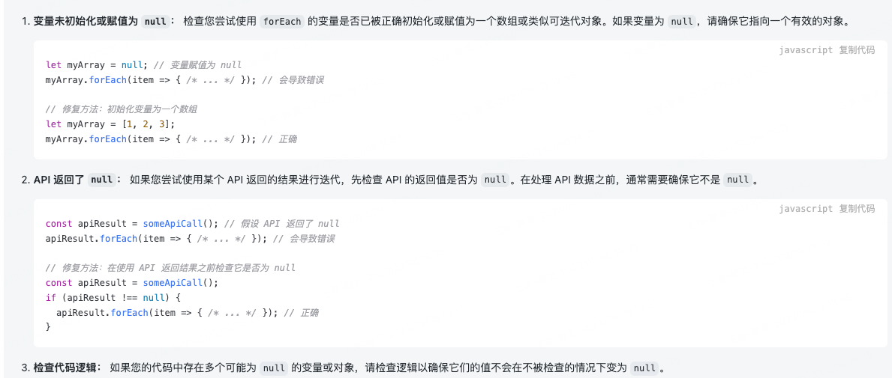
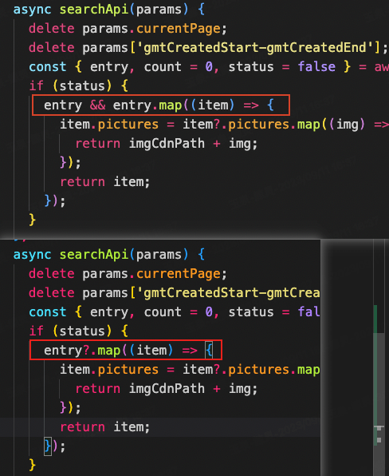

# 错误信息和解决方案

## yarn 很慢 info There appears to be trouble with your network connection. Retrying

yarn config set disable-self-update-check true（修改配置禁止检查更新）



## js 常见错误类型

### 一、SyntaxError JS 引擎解析代码时发生的语法错误

- 声明的变量名不符合规范：**首位**必须是 字母、下划线（\_）或美元符号（$）

`var 1 // SyntaxError: Unexpected number`

- 给关键字赋值

`function = 5 、 var 1a // _Uncaught SyntaxError: Unexpected token_`

### 二、 TypeError 类型错误

- 变量或参数不是预期类型时发生的错误
- 调用不存在的方法 `123() 、 var oo = {} oo.run()`
- new 关键字后接基本类型： `var a = new 123`

### 三、 ReferenceError 这玩意不存在

- 调用了一个未被定义的变量 `ReferenceError: xxx is not defined`
- 给一个无法被赋值的对象赋值：`console.log("123") = 1`

### 四、 RangeError

当一个值超出有效范围时发生的错误。

- 数组长度为负数

`new Array(-1); // RangeError: Invalid array length`

- Number 对象的方法参数超出范围
- 函数堆栈超过最大值

## vs code 配合 eslint

参考方案: [点击查看](https://zhuanlan.zhihu.com/p/421867479)

Vue2.0 项目配置 ESLint [点击查看](https://www.jianshu.com/p/bfc13fb6c6ed)

Vite vue3 EsLint [点击查看](https://www.jianshu.com/p/4b94540dd998)

## try catch 兜底

任何你感觉可能会出现问题的地方都可以使用 tray catch 包起来给你兜底

```js
try {
  alert("把代码放到这里");
  alert("如果某个代码报错了");
  alert("这里是异常后的语句"); // 发生异常，所以不会执行到这里
} catch (error) {
  alert("发生异常了，来到我这里了");
}
```

```js
try {
  alert("把代码放到这里");
  alert("如果某个代码报错了");
  alert("这里是异常后的语句"); // 发生异常，所以不会执行到这里
} catch (error) {
  alert("发生异常了，来到我这里了");
} finally {
  alert("不管任何情况，都会来到我这里了"); // 厉害吧
}
```

## 切换 radio 的时候谷歌浏览器报：Blocked aria-hidden on an element xxx

解决方案：

```css
div[aria-hidden="true"] {
  display: none !important;
}
```

## npm 包版本禁用提示或者删除

```bash

#废弃提示
npm deprecate @webuy/lib@2.0.1-betax "此版本存在问题，请立即升级到 2.0.2 版本"

#直接删除
npm unpublish @webuy/lib@2.0.0-beta1 --force（废弃2.0.0-beta1版本）
```

## yarn 报 network connection. Retrying... 错误 等待 120s

### 方案一

把 yarn 改为 yarn install --non-interactive

### 方案二

yarn config set disable-self-update-check true（修改配置禁止检查更新）

### 方案三

把项目的 yarn.lock 删掉试试

## vscode ide 配置

```json
"editor.cursorBlinking": "expand", // 设置光标闪烁样式为扩展
"editor.cursorSmoothCaretAnimation": "on", // 启用光标平滑动画
"editor.guides.bracketPairs": "active", // 显示括号配对指南
```

## npm 打包（基础）

```sh
npm run build:lib
npm run release
beta 的话就跟上 beta
1.0.10-beta12
1.0.11
```

## nodejs 如果需要给某个接口设置独立的请求时长

`this.ctx.req.setTimeout(60 * 60 * 1000);`

## 本地 git push 很慢

这个不好解决，主要是看代理

## ResizeObserver loop

错误原因：element-ui el-table 重绘导致，这个错误是浏览器的一种保护机制，以防止无限循环占用大量 CPU 资源。

解决方案：element-ui 组件库源码改动，兼容, 已修复：[参考](https://blog.csdn.net/gudeng007/article/details/125765927)

## Script error

错误原因：受浏览器同源策略限制，未知跨域脚本执行错误时，抛出的错误信息为 "Script error."

解决方案：

1、给 `<script>` 添加 crossorigin 属性

2、监控包内拦截原生事件 try catch 住

## cancel

错误原因：第三方库中 dialog 组件异步关闭触发。该错误 errInfo.type 值为 unhandledrejection，触发监控包 unhandledrejection 的捕获。

解决方案：异步关闭时控制台会触发 Uncaught (in promise) cancel。
可以在事件后面加 catch 捕获

## The operation was aborted

不用修复，统计过滤。浏览器兼容问题。

## Network Error

`{"msg":"request_error","status":0}`

错误原因：业务项目中把 request 底层函数封装了，但是丢失了字段

解决方案：需要在项目响应函数的 reject 里传入 isAxiosError，可以从 error 里取同名字段

## Cannot read properties of undefined (reading 'length')

http 接口报错，返回 undefined 导致，需要在请求包里做兼容处理。

## Cannot read properties of null (reading 'length')

兜底判断：xxx && xxx.length

## Cannot read properties of null (reading 'forEach')



## TypeError: Cannot read properties of null (reading 'map')


