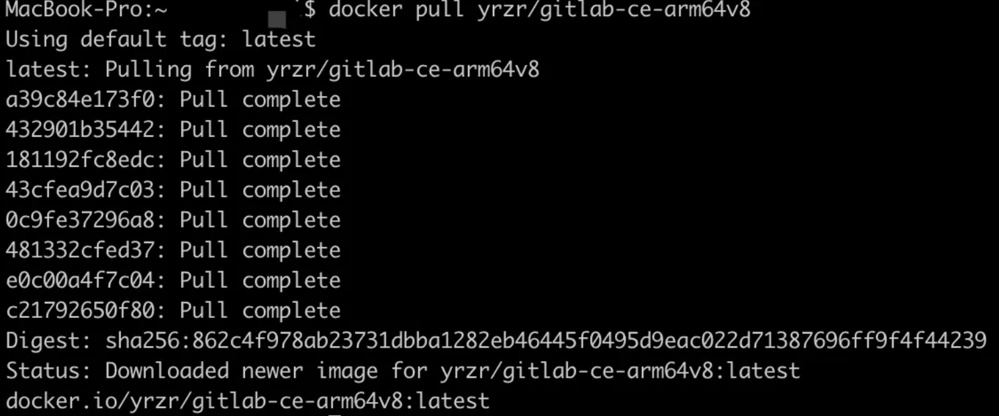
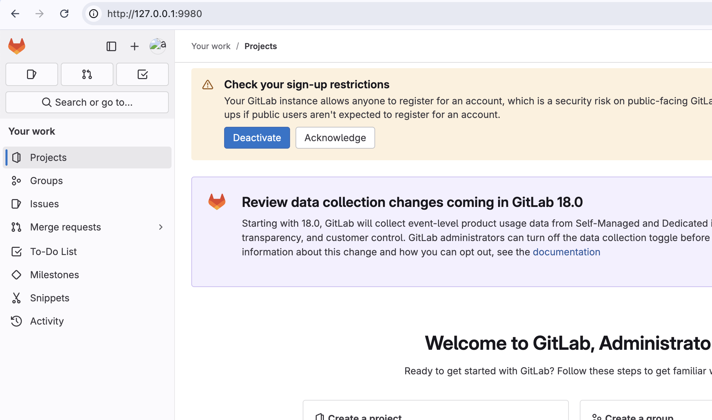
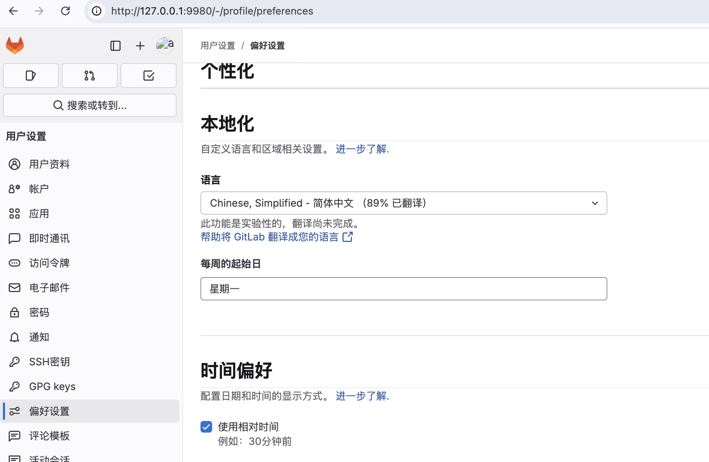

# 搭建 gitlab 环境

## mac m1 系统搭建

### 1. 安装 docker

直接去官网下载安装即可

### 2. 安装 gitlab 镜像

由于 Mac M1 芯片，找镜像的时候需要 ARM 64，然后一般推荐的镜像就是 gitlab-ce。

```bash
docker search gitlib-ce

# 下载镜像
docker pull yrzr/gitlab-ce-arm64v8:latest

```

这样的代表下载成功了！



注意 📢：这里很有可能会遇到下载不下来的问题。一般都是因为网络问题导致的，所以需要配置下 docker 的镜像源地址。

这里我推荐这个网站上去找：[目前国内可用 Docker 镜像源汇总](https://www.coderjia.cn/archives/dba3f94c-a021-468a-8ac6-e840f85867ea)

### 3. 启动 gitlab

```bash
docker run \
  -itd \
  --detach \
  --restart always \
  --name gitlab-ce \
  --privileged \
  --memory 4096M \
  --publish 9922:22 \
  --publish 9980:80 \
  --volume ~/gitlab/etc:/etc/gitlab:z \
  --volume ~/gitlab/log:/var/log/gitlab:z \
  --volume ~/gitlab/opt:/var/opt/gitlab:z \
  yrzr/gitlab-ce-arm64v8:latest
```

注意 📢：如果报错 invalid reference format，请检查 路径是否正确。

#### 常见问题排查

1.如果仍然报错 invalid reference format

- 检查 --volume 路径是否正确，确保没有多余的空格或特殊字符。

- 确保 yrzr/gitlab-ce-arm64v8:latest 镜像名称拼写正确（可以先用 docker pull yrzr gitlab-ce-arm64v8:latest 测试是否能拉取）。

  2.如果报错 No such file or directory

- 确保本地目录已创建（mkdir -p ~/gitlab/{etc,log,opt}）。

- 如果路径包含空格或特殊字符，建议用引号包裹：

```bash
--volume "$HOME/gitlab/etc:/etc/gitlab"
```

3.如果报错 Permission denied

- 尝试去掉 :z 选项（Mac 通常不需要 SELinux 配置）：

`--volume ~/gitlab/etc:/etc/gitlab`

- 或者手动赋予目录权限：

```bash
chmod -R 777 ~/gitlab # 仅用于测试环境，生产环境需严格限制权限
```

### 4.配置 gitlab 访问地址

进入容器修改配置：

```bash
docker exec -it gitlab-ce /bin/bash
vi /etc/gitlab/gitlab.rb
```

添加：

```bash
external_url 'http://<你的Mac本地IP>:9980'  # 如 http://192.168.1.100:9980
gitlab_rails['gitlab_ssh_host'] = '<你的Mac本地IP>'  # 如 192.168.1.100
gitlab_rails['gitlab_shell_ssh_port'] = 9922
nginx['listen_addresses'] = ['0.0.0.0']  # 允许所有 IP 访问
nginx['listen_port'] = 80                # 确保端口正确
```

注意：:wq! 保存并退出但是报错:Press ENTER or type command to continue

应用配置并重启：

```bash
gitlab-ctl reconfigure
gitlab-ctl restart
exit
```

#### 问题：这里配置并重启之后连接访问不了了

效果是: 无法访问此网站

真的很神奇，原本没配置的时候还是可以访问的。

**解决方案**
验证 GitLab 服务监听地址
进入容器检查 Nginx 是否监听所有地址（0.0.0.0:80）：

```bash
docker exec -it gitlab-ce netstat -tuln | grep 80
```

预期输出：

```bash
tcp   0   0 0.0.0.0:80    0.0.0.0:*     LISTEN
若输出为 127.0.0.1:80：
```

说明服务仅绑定到容器本地地址，需修改配置：

编辑 /etc/gitlab/gitlab.rb：

```bash
nginx['listen_addresses'] = ['0.0.0.0']  # 允许所有 IP 访问
nginx['listen_port'] = 80                # 确保端口正确
```

重新配置并重启：

```bash
gitlab-ctl reconfigure
gitlab-ctl restart nginx
```

### 5.检查是否可以访问

- 访问 http://localhost:9980

### 6.配置 gitlab root 密码

网页端修改（推荐）

**正确修改 GitLab 用户密码的方法**
如果你想修改 GitLab 用户的密码（例如 `root` 或其他用户），应该这样操作：

---

#### **方法 1：通过 GitLab Rails Console 修改密码**

1. **进入 GitLab Rails Console**（在容器内执行）：耐心等待一会

   ```bash
   docker exec -it gitlab-ce gitlab-rails console
   ```

   （如果是非容器环境，直接运行 `gitlab-rails console`）

2. **查找用户并修改密码**（例如修改 `root` 用户的密码）：

   ```ruby
   user = User.find_by(username: 'root')  # 或 email: 'admin@example.com'
   user.password = '数字+字母!'           # 新密码
   user.password_confirmation = '数字+字母!'
   user.save!
   ```

   - **如果成功**，会返回 `true`。
   - **否则失败**，检查错误信息（如密码太短）。

3. **退出 Console**：

   ```ruby
   exit
   ```

---

#### **方法 2：直接使用 `gitlab-rails` 命令修改**

```bash
docker exec -it gitlab-ce gitlab-rails runner "user = User.find_by(username: 'root'); user.password = 'admin123!'; user.password_confirmation = 'admin123!'; user.save!"
```

（适用于脚本自动化修改）

---

#### **方法 3：通过 Web 界面修改**

1. 访问 `http://localhost:9980`（或你的 GitLab 地址）。
2. 使用 `root` 账户登录（初始密码在容器日志里找，或运行 `docker exec -it gitlab-ce cat /etc/gitlab/initial_root_password`）。
3. 进入 **用户设置 → 修改密码**。

---

#### **常见问题**

#### **1. `NameError: undefined local variable 'user'`**

- **原因**：你直接运行 `user.password="..."`，但 `user` 未定义。
- **解决**：必须先 `User.find_by(...)` 获取用户对象。

#### **2. `ActiveRecord::RecordInvalid`（保存失败）**

- **可能原因**：
  - 密码太短（GitLab 默认要求至少 8 位）。
  - 用户不存在（检查 `username` 或 `email` 是否正确）。
- **解决**：

  ```ruby
  user = User.find_by(username: 'root')
  user.password = 'a_longer_password_123!'  # 至少 8 位
  user.password_confirmation = 'a_longer_password_123!'
  user.save!
  ```

#### **3. 忘记 `root` 密码**

- 如果无法登录，可以用 **方法 1** 或 **方法 2** 重置密码。

---

#### **总结**

- **错误原因**：直接使用未定义的 `user` 变量。
- **正确做法**：
  - 先 `User.find_by` 查找用户。
  - 再修改密码并 `save!`。
- **推荐方法**：使用 `gitlab-rails console` 或 `gitlab-rails runner`。

现在你可以成功修改 GitLab 用户的密码了！



进入 Preferences → Language，选择 简体中文。 保存并刷新页面即可


