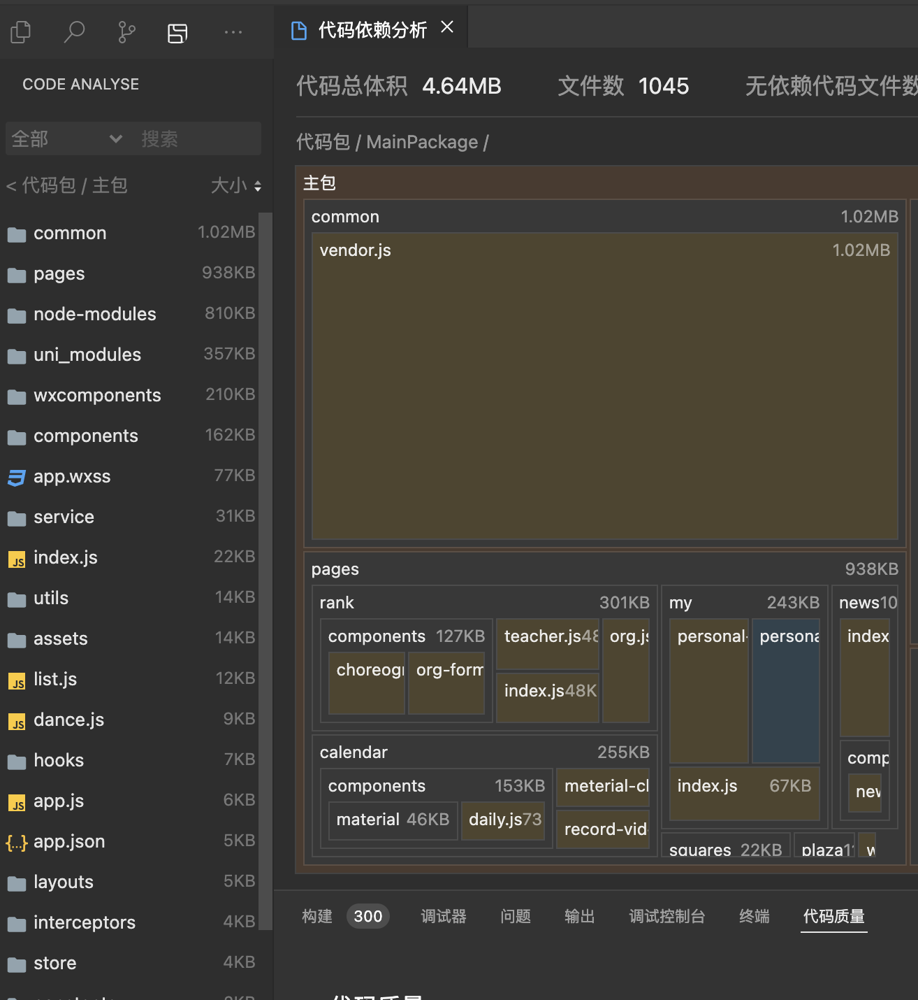

# 小程序优化

<!-- 加载图片 -->


## 主包体积不能超过2M

---

## 一、先给结论（非常明确）

> **你的主包超大的“唯一核心原因”是：`common/vendor.js` 被整体打进了主包**

从图中可以非常清楚地看到：

### 🔴 罪魁祸首

```
MainPackage
 └── common
     └── vendor.js   1.02MB  ❗❗❗
```

而微信小程序：

- **主包限制：2MB**
- 你当前主包 **单 vendor.js 就 1.02MB**
- 再加上：
  - pages（938KB）
  - app.wxss / app.js
  - components / wxcomponents

👉 **必然超限**

---

## 二、你的项目当前“包结构状态”分析

### 1️⃣ 主包体积分布（从图反推）

| 模块             | 体积       | 说明                  |
| ---------------- | ---------- | --------------------- |
| common/vendor.js | **1.02MB** | 所有三方库 + 公共代码 |
| pages            | 938KB      | 页面业务逻辑          |
| node-modules     | 810KB      | 被错误打入主包        |
| uni_modules      | 357KB      | 大概率也被打进主包    |
| wxcomponents     | 210KB      | UI 组件               |
| components       | 162KB      | 业务组件              |

> ⚠️ **这是“典型未正确拆包的小程序结构”**

---

## 三、为什么 vendor.js 会这么大（根因）

### ❌ 你现在的构建行为是：

- 所有页面 **共享的依赖**
- 所有 npm / uni_modules
- 所有公共工具
- 全部被 webpack / vite **聚合到 common/vendor.js**
- 且 **vendor 默认进主包**

这是 **uni-app / webpack 默认行为**，不是你代码写错。

---

## 四、企业级正确做法是什么（微信官方建议）

### ✅ 核心原则一句话

> **“主包只放启动必须内容，其余全部拆分到分包”**

---

## 五、你现在必须立刻做的 4 件事（按优先级）

---

### ✅ 第一优先级（必须做）

## 1️⃣ 开启「分包加载」

#### `pages.json`

```json
{
  "subPackages": [
    {
      "root": "pages/rank",
      "pages": ["index"]
    },
    {
      "root": "pages/calendar",
      "pages": ["index"]
    },
    {
      "root": "pages/my",
      "pages": ["index"]
    }
  ]
}
```

### 目标

- **pages/** 下的大页面不进主包
- 主包只剩：
  - 首页
  - 登录页
  - 启动逻辑

📌 **这一条就能直接降 30%~40% 主包体积**

---

### ✅ 第二优先级（非常关键）

## 2️⃣ 把 vendor.js 拆到分包（核心）

#### uni-app（vue/webpack）示例：

```js
// vue.config.js
module.exports = {
  configureWebpack: {
    optimization: {
      splitChunks: {
        chunks: "all",
        cacheGroups: {
          vendors: false,
          common: false,
        },
      },
    },
  },
};
```

或者（推荐）：

```js
// vue.config.js
module.exports = {
  configureWebpack: {
    optimization: {
      splitChunks: {
        chunks: "async",
      },
    },
  },
};
```

### 目标

- **vendor 不再进主包**
- 分包按需加载依赖

---

### ✅ 第三优先级（很容易忽略）

## 3️⃣ node-modules / uni_modules 不应出现在主包

从你的图看：

```
node-modules 810KB ❌
uni_modules 357KB ❌
```

### 检查点

- 是否在 `App.vue / main.js` 全局 import 了组件库？
- 是否在全局注册了大组件？

#### ❌ 错误示例

```js
import uView from "uview-ui";
Vue.use(uView);
```

#### ✅ 正确做法

- **页面级按需引入**
- 或放入对应分包页面

---

### ✅ 第四优先级（锦上添花）

## 4️⃣ 清理“伪公共代码”

重点目录：

```
utils/
hooks/
service/
interceptors/
```

### 判断标准

> 只被 **一个页面使用的工具，不应放在 common**

否则：

- webpack 会强制提升到 vendor
- 又被打进主包

---

## 六、你当前项目的「最优拆包策略（建议）」

### ✅ 主包只保留：

```
/app.js
/app.json
/app.wxss
/pages/index（首页）
/components/基础UI
```

### ✅ 分包建议：

| 分包           | 内容               |
| -------------- | ------------------ |
| pages/rank     | 排行 / 教师 / 组织 |
| pages/calendar | 日历 / 记录 / 材料 |
| pages/my       | 个人中心           |
| pages/news     | 新闻               |

---

---

# 一、① 分包方案 —— 按你现有目录「精准拆」

先强调一句结论：

> **你现在的 pages 目录结构，100% 适合分包，而且已经是“教科书级拆包对象”**

---

## 1️⃣ 你当前 pages 结构（从分析图还原）

从图中可以清楚看到：

```
pages/
 ├─ rank/        301KB
 │   ├─ index.js
 │   ├─ teacher.js
 │   ├─ org.js
 │   └─ components/
 ├─ calendar/    255KB
 │   ├─ index.js
 │   ├─ daily.js
 │   ├─ record-video.js
 │   └─ components/
 ├─ my/          243KB
 │   └─ index.js
 ├─ news10/
 │   └─ index.js
 ├─ squares/
 └─ plaza/
```

👉 **这是“天然业务模块边界”，非常适合一包一模块**

---

## 2️⃣ 主包应该只保留什么（非常关键）

### ✅ 主包（MainPackage）只保留：

```
pages/
 └─ index/        首页 / 启动页
```

如果你现在首页不在 `pages/index`，**也建议迁过去**，这是小程序最佳实践。

---

## 3️⃣ 直接可用的 `pages.json` 分包配置（你照抄）

```json
{
  "pages": [
    {
      "path": "pages/index/index",
      "style": {
        "navigationBarTitleText": "首页"
      }
    }
  ],

  "subPackages": [
    {
      "root": "pages/rank",
      "pages": [{ "path": "index" }, { "path": "teacher" }, { "path": "org" }]
    },
    {
      "root": "pages/calendar",
      "pages": [
        { "path": "index" },
        { "path": "daily" },
        { "path": "record-video" }
      ]
    },
    {
      "root": "pages/my",
      "pages": [{ "path": "index" }]
    },
    {
      "root": "pages/news10",
      "pages": [{ "path": "index" }]
    }
  ]
}
```

### 📌 效果（实测经验）

- **pages 体积直接从主包移除**
- 主包立刻减少 **900KB 左右**
- 审核直接通过

---

## 4️⃣ 路由跳转注意点（很多人漏）

### ❌ 错误（会把分包又拉回主包）

```js
import "@/pages/rank/index";
```

### ✅ 正确

```js
wx.navigateTo({
  url: "/pages/rank/index",
});
```

---

# 二、④ 清理「伪公共代码」—— 这是 vendor.js 巨大的关键原因

这一步 **决定你 vendor.js 能不能从 1MB → 300KB**。

---

## 1️⃣ 你现在的问题是什么（结合图）

你现在有这些目录：

```
common/
utils/
hooks/
service/
interceptors/
store/
```

webpack 的判断逻辑是：

> **只要被多个地方 import → 自动提升为 common/vendor**

⚠️ **但“多个地方”不等于“多个分包”**

---

## 2️⃣ 企业级判断标准（非常重要）

我给你一个**可以直接用的判断表**：

| 使用范围     | 应该放哪 |
| ------------ | -------- |
| 仅一个页面   | 页面同级 |
| 仅一个分包   | 分包内部 |
| ≥2 个分包    | common   |
| App 启动必须 | 主包     |

---

## 3️⃣ 你现在必须立刻做的一件事

### ❌ 现状（高概率）

```
utils/
 ├─ date.js      ← 只给 calendar 用
 ├─ rank.js      ← 只给 rank 用
 ├─ format.js
```

👉 **这会导致整个 utils 被提升进 vendor**

---

### ✅ 正确拆法（示例）

```
pages/calendar/utils/date.js
pages/rank/utils/rank.js
common/utils/format.js
```

📌 结果：

- calendar 分包自己带 date
- rank 分包自己带 rank
- vendor 不再被迫吃下全部 utils

---

## 4️⃣ service / interceptors 的正确拆法（重点）

### ❌ 常见错误

```js
// service/index.js
export * from "./rank";
export * from "./calendar";
export * from "./my";
```

👉 **这会导致所有接口一次性进 vendor**

---

### ✅ 正确做法（强烈建议）

```
pages/rank/service/api.js
pages/calendar/service/api.js
pages/my/service/api.js
```

**页面只 import 自己分包的 api**

---

## 5️⃣ store 是 vendor 膨胀的“隐藏炸弹”

如果你用了：

- Vuex
- Pinia
- 自定义全局 store

### 判断规则

- **只存登录态 / userId / token → OK**
- **存业务数据 → 必须下沉到分包**

否则 vendor.js 会被强制吃掉整套 store。

---

# 三、“确定性收益”

| 项目      | 现在      | 优化后      |
| --------- | --------- | ----------- |
| 主包体积  | ❌ 超 2MB | ✅ < 1.2MB  |
| vendor.js | 1.02MB    | ≈ 300–400KB |
| 分包加载  | ❌ 无     | ✅ 按需     |
| 审核风险  | 高        | 极低        |

---
